<!-- Source -->
[World's Most Advanced Video Editing Tutorial (Premiere Pro) - Editing LTT from start to finish](https://www.youtube.com/watch?v=O6ERELse_QY)

<!--####################################################################################################################-->
# Resources
<!--####################################################################################################################-->

  - [Interception - Francisco Lopes](http://www.oblita.com/interception)
  - [TaranVH/2nd-keyboard: ALL of Taran's scripts - not just for the 2nd keyboard.](https://github.com/TaranVH/2nd-keyboard)
  - [Advanced Scene Switcher | OBS Forums](https://obsproject.com/forum/resources/advanced-scene-switcher.395/)
  - [ShadowPlay: Record, Share Game Videos & Screenshots | NVIDIA](https://www.nvidia.com/en-us/geforce/geforce-experience/shadowplay/)
    - record screencasts with GPU only

<!--####################################################################################################################-->
# Workflow
<!--####################################################################################################################-->

  - Templates
    - define folder structure w/ necessary assets
      - video files
        - common assets + structure already implemented
        - placeholders for project-specific content

  - Cutting Out Dead Space
    - do multiple passes
      - first pass: rough cuts
      - refine cut points while working through sequence at a finer level of detail

  - have `razor` ready to go while watching
    - use it, even if it falls slightly after the actual cut point, then go back @ refine when necessary

  - pay attention to waveforms to help identify cut points

  - use `Label Colors` to provide additional context @ clips
    - questionable / potentially removable clips
    - review
    - edit
    - issue

  - break up A-roll into clips, with B-roll in mind

  - use `Audio Track Mixer` to apply track-level processing
    - LTT Preset  
      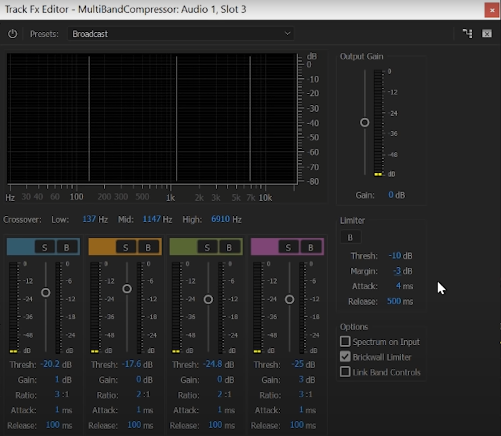

  - Bin Thumbnails
    - scroll through to load all
    - keep open, thumbnails are destroyed when closing bins

  - make AHK commands to insert frequently used assets @ mouse position

  - Destructive Editing
    - e.g. censoring by replacing swear word with SFX
    - [Tools] for adjusting placement
      - `Slide`
      - `Rolling Edit`

  - Precision Editing
    - `Timeline Menu > Show Audio Time Units`
    - single frame `Cross-Dissolve`

  - Transitions
    - built-in transitions cannot be saved as presets, but 3rd party transitions can

  - use `Nesting` to clean up the timeline by containerizing groups of clips
    - multiple tracks can be condensed into a single clip, which can be entered to make further edits to the original layered structure
    - [WHAT is Nesting in Premiere Pro and WHY is it Important?](https://www.youtube.com/watch?v=A8Aw53JBLZY)
    - alternative: render part of the timeline & re-import it

  - adjust speed throughout clip via `Clip Menu > Time Remapping > Speed`

  - to improve efficiency of finding assets, spend some time becoming familiar with your asset libraries & creating a mental model to draw from

  - visual considerations
    - "Eye Trace"
      - which part of the shot the viewer's eyes are focusing on at any given moment
    - avoid
      - showing too many things at once
      - content that distracts from the focus of the shot

  - zoom to optimal level when taking screenshots of web pages

<!--####################################################################################################################-->
# Guidelines
<!--####################################################################################################################-->

  - File Structure
    - versioning system
    - prefixing convention

  - Content Structure
    - guide/explanation conventions to maintain context & intent
      - @ [scripts, notes, assets, etc.]

  - Audio Levels
    - aim to average between -3 to -15 db
    - make sure SFX, Music, & B-roll don't overpower A-roll

  - Color Accuracy
    - use Film Slate for reference @ start of video

  - Rolls
    - [A] main content
    - [B] supporting graphics
    - [C] lead's supporting content

  - avoid dead space @ [audio, video] at any point in the video
    - use subtle animations for static content if nessary (*pan, zoom, etc.*)

  - use `Disable` instead of `Delete` for any content that isn't 100% unneeded

  - be prepared to dismiss/archive content that really just doesn't fit the scene, even if it required substantial effort / resources

  - when using a multi-cam setup, only switch when necessary. don't use new angles just for the sake of using them.

  - some compression algorithms result in slower scrubbing/rendering
    - CineForm is optimal

  - `Automate To Timeline` can be used to batch-move a cluster of clips from a bin to the timeline
    - placement via markers
    - files must be ordered correctly

  - Preferences

    - `Menu > Edit > Preferences`
      - `General`  
        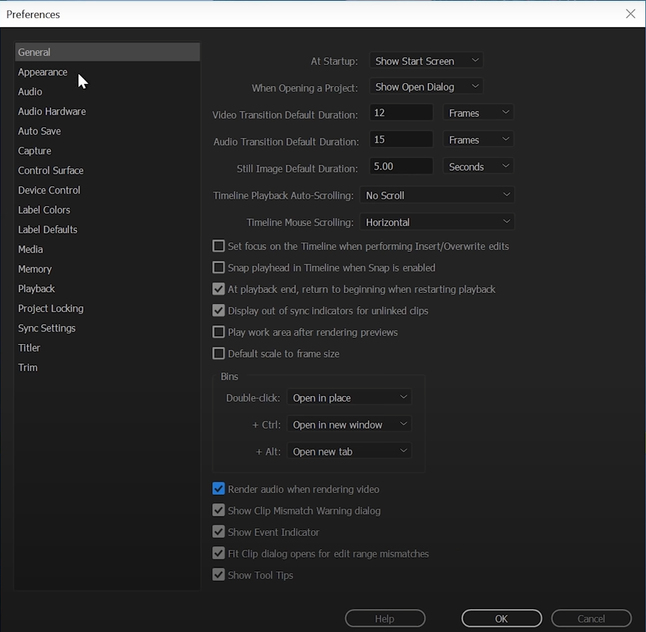
      - `Audio`  
        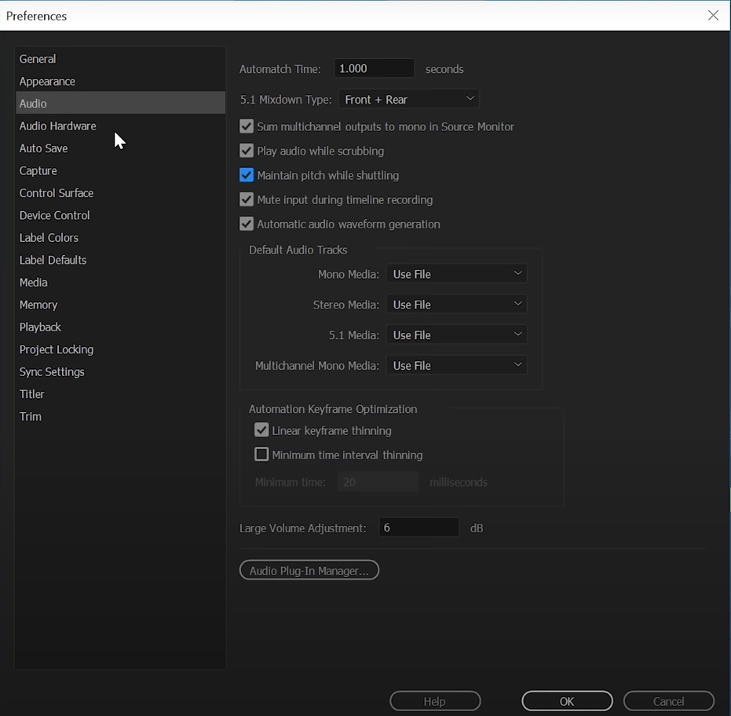
      - `Auto-Save`  
        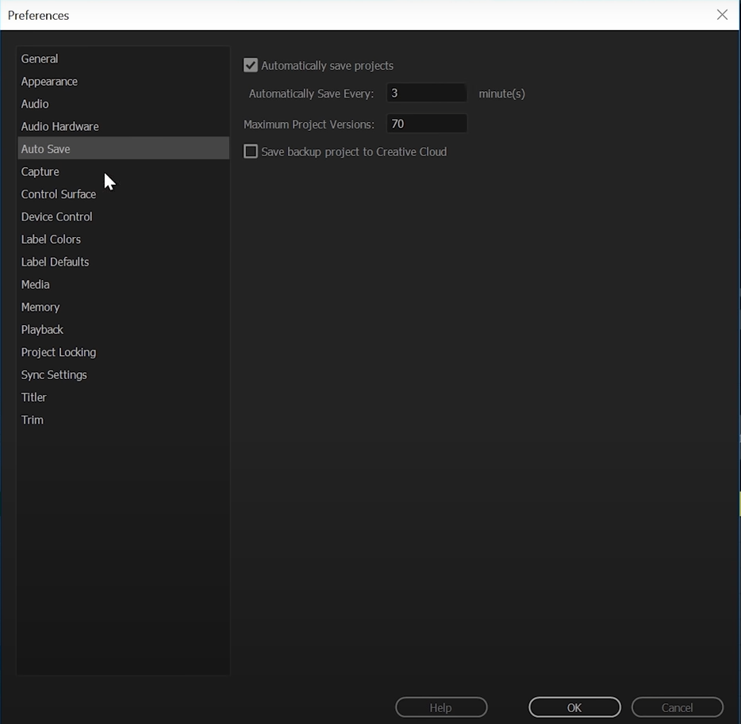

    - `Audio Meter > ContextMenu`  
      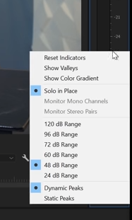

    - `Audio Track > Settings`  
      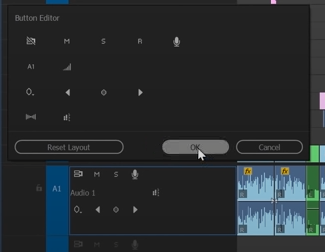

    - `Clip > Link Media > Settings`  
      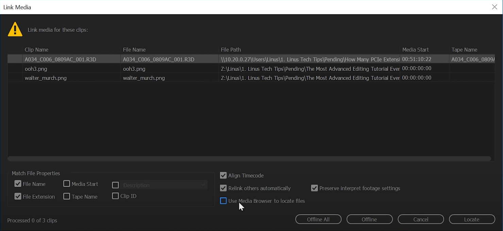
      
    - `Effect Controls > Menu`  
      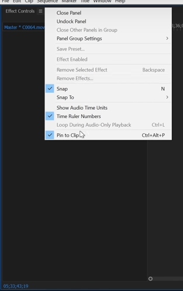

    - `History > Menu`  
      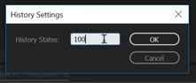

    - `Program > Button Settings`  
      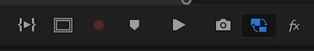

    - `Sequence > Menu`  
      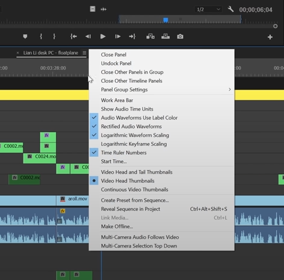

    - `Timeline > Menu`  
      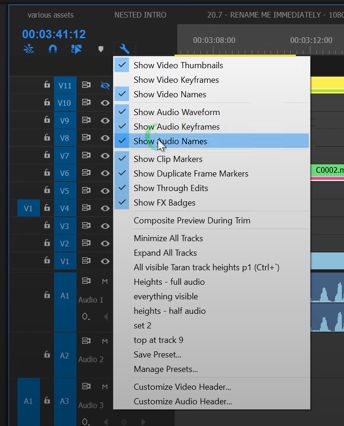

    - `Menu > Markers > Ripple Sequence Marks`
      - enable
      - moves markers after `Ripple Trim`

<!--####################################################################################################################-->
# Keyboard Shortcuts
<!--####################################################################################################################-->

  - toggle timeline `Snap`

<!--####################################################################################################################-->
# AHK Scripts
<!--####################################################################################################################-->

  - [23:40] 6.1d: AHK Right click playhead mod
  - [28:40] 6.2a: MACRO Ripple delete clip at playhead
  - [42:48] 8a: AHK trackLocker()

  - [How to enable FASTER SCROLLING in Premiere Pro -- and everywhere else! - YouTube](https://www.youtube.com/watch?v=OobKVPojFmg)

<!--####################################################################################################################-->
# Avoid
<!--####################################################################################################################-->

  - updating immediately when releases are available
    - [Why] major bugs have made it to release
    - [Alternative] wait at least a month

  - `Scale To Frame Size`
    - [Why]
      - misleading name
      - results in image deterioration
    - [Alternative]
      - `Set To Frame Size`

  - using markers directly on clips
    - [Why] Premiere tries to save to source file, sometimes causes crashes

  - Three Point Editing [`Insert`, `Overwrite`]
    - [Why] editing DX is not great
    - [Alternative] draft region @ `Source`, drag to timeline from clip-icon

  - relying on Auto-Save
    - [Why]
      - it can stop working, before an actual crash actually occurs, resulting in a loss of work
    - [Alternative]
      - save frequently
      - make backups

  - moving clips with transitions directly on to another clip
    - [Why] transitions are not merged appropriately
    - [Alternative] delete transition, then reapply after merging

  - rendering from higher to lower resolution
    - [Why] static graphics will have their resolution scaled down & become pixelated
    - [Alternative] render at higher resolution

  - `Preferences > General > Default scale to frame size`
    - [Why] it will ruin footage
    - [Alternative] do it manually

  - `Sync`
    - [Why] it can overwrite your settings erroneously
    - [Alternative] save settings manually
      
  - `Track Forward` Tool
    - [Why] it will move clips, but not markers
    - [Alternative] `Ripple Move`

  - `Clip > Link Media > Settings > Use Media Browser to locate files`
    - [Why] the interface is slow & buggy
    - [Alternative] disable, use explorer instead

<!--####################################################################################################################-->
# Troubleshooting
<!--####################################################################################################################-->

  - [Unofficial Premiere Pro Troubleshooting Guide](https://community.adobe.com/t5/premiere-pro-discussions/unofficial-premiere-pro-troubleshooting-guide/td-p/8789200)
  - [Taran's feature requests and bug reports     ](https://docs.google.com/spreadsheets/d/1dVJb7kI_ZETLavrplfARgn9gL8HUpvkq6A0jCPxqA3w/edit#gid=1133868629           )

  - Lag
    - render audio/video clips to reduce computation
    - copy entire timeline to a new sequence
    - make sure static graphics have speed set @ 100%
      - this isn't something that should be modified while editing, but it can happen accidentally via `Rate Stretch` tool

  - Unresponsiveness to `Stop` button/command
    - set a stop point on the timeline

